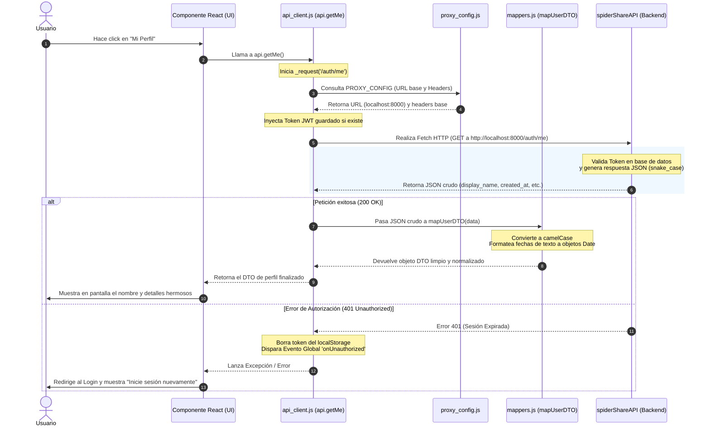

# 🌉 Capa de Conectividad Intermedia de Cliponomicon
## *Guía de Arquitectura, Flujo de Datos y Bitácora de Aprendizaje*

Este documento sirve como la **guía definitiva y README principal** para comprender, mantener y aprender sobre la capa intermedia (SDK / API Client) ubicada en `Front/Cliponomicon/back`. Su principal objetivo es conectar de forma segura, limpia e inteligente la interfaz de usuario en React (`Front/Cliponomicon`) con el backend FastAPI (`Api/spiderShareAPI`), **evitando por completo que se comuniquen entre sí de manera directa o acoplada**.

Este documento está escrito de forma didáctica para que cualquier persona, **incluso sin conocimientos previos en programación o redes**, pueda entender el funcionamiento del proyecto desde cero, comprender los errores comunes del pasado y aprender a solucionarlos de forma profesional.

---

## 📖 ¿De qué va este Proyecto? (Aprender desde Cero)

Imagina un restaurante moderno:
1. **El Frontend (React):** Es la **sala del restaurante**, las mesas y la carta que ven los clientes. Su función es ser atractiva, receptiva y cómoda para el usuario.
2. **El Backend / API (FastAPI):** Es la **cocina**. Allí se procesan los ingredientes, se consulta la despensa (base de datos) y se prepara la comida.
3. **La Capa Intermedia (`back`):** Es el **camarero**. 
   * Si los clientes de la sala entraran directamente a la cocina a coger comida o a gritarle a los cocineros, habría un caos absoluto (acoplamiento fuerte).
   * Si la cocina cambiara la forma de servir un plato (cambio de nombres de campos en la base de datos), el cliente en la sala se quejaría de inmediato.
   * El camarero se encarga de:
     * Tomar la orden en el idioma de la sala y traducirla a la cocina.
     * Traer la comida de la cocina, quitar las partes sucias o innecesarias y presentarla en un plato limpio adaptado al cliente (Patrón DTO / Mapper).
     * Administrar los accesos y credenciales (si el cliente tiene pase VIP / Token de autenticación).

Esta carpeta `back` contiene precisamente al "camarero" de nuestra aplicación, compuesto por tres herramientas esenciales: `proxy_config.js`, `api_client.js` y `mappers.js`.

---

## 1. Arquitectura de los Tres Pilares (El Puente)

La capa intermedia está dividida en tres módulos independientes con responsabilidades claramente delimitadas:

```
📁 Front/Cliponomicon/back/
├── 📄 proxy_config.js  --> La Brújula y Aduana (Configuración de red y tokens)
├── 📄 api_client.js    --> El Mensajero (Motor que realiza las peticiones HTTP)
└── 📄 mappers.js       --> El Traductor (Capa DTO que estandariza los datos)
```

### A. `proxy_config.js` (La Brújula y Aduana)
* **¿Qué hace?:** Define las reglas del juego de red. Centraliza hacia dónde se enviarán las peticiones (la URL base) y las opciones globales del navegador como las políticas de intercambio de recursos de origen cruzado (CORS).
* **Servicio que proporciona:** Garantiza que cambiar de entorno (por ejemplo, probar en tu ordenador local o subir el código a un servidor en internet) sea automático y requiera **cero modificaciones en el código de los componentes**.
* **Helper clave:** Ofrece `getAuthHeaders(token)`, encargado de empaquetar de forma segura la cabecera `Authorization: Bearer <token>` para presentarse ante la API.

### B. `api_client.js` (El Mensajero / Motor)
* **¿Qué hace?:** Es el núcleo operativo de la comunicación. Contiene la clase `SpiderShareClient` (instanciada globalmente como `api`).
* **Servicio que proporciona:** 
  * Realiza los envíos físicos de red mediante la función `fetch` bajo el método centralizado privado `_request`.
  * Gestiona las sesiones de usuario guardando de forma segura y reactiva el token de acceso JWT (`localStorage`).
  * Intercepta caídas de red y respuestas de seguridad (como un error `401 Unauthorized` de sesión expirada) para desconectar al usuario automáticamente y avisar al frontend que debe redirigir al login.
  * Formatea de manera inteligente las respuestas del servidor y las estructura antes de entregarlas a los componentes.

### C. `mappers.js` (El Traductor Oficial / Capa DTO)
* **¿Qué hace?:** Es una barrera de protección técnica llamada **Capa Anti-Corrupción (Anti-Corruption Layer)**. 
* **Servicio que proporciona:**
  * El Backend (Python/FastAPI) suele usar variables con guiones bajos (estilo `snake_case`, ej. `display_name`).
  * El Frontend (JS/React) prefiere variables con mayúsculas intermedias (estilo `camelCase`, ej. `displayName`).
  * `mappers.js` toma el JSON crudo del backend y lo traduce instantáneamente a un objeto JavaScript normalizado, limpiando valores vacíos (`null` en lugar de `undefined`) y formateando fechas reales (`new Date()`).
  * Si el backend cambia el nombre de una propiedad de la base de datos, **los componentes React no se rompen**. Solo se actualiza la regla de traducción en `mappers.js`.

---

## 2. Explicación de Bloques de Código Clave

Para comprender la inteligencia de esta capa intermedia, analicemos algunas líneas del código que agilizan de forma automática el flujo de conectividad:

### A. Configuración Dinámica con Fallback Inteligente
En `proxy_config.js` encontramos:
```javascript
export const PROXY_CONFIG = {
    // URL base centralizada
    BASE_URL: import.meta.env.VITE_API_URL || 'http://localhost:8000',

    // Configuración predeterminada para peticiones CORS
    FETCH_OPTIONS: {
        mode: 'cors',
        headers: {
            'Content-Type': 'application/json',
            'Accept': 'application/json'
        }
    }
};
```
#### ¿Cómo funciona esto y por qué es una maravilla?
1. **`import.meta.env.VITE_API_URL`:** Es un "sensor" de entorno que provee la herramienta de compilación Vite. Si el proyecto se está ejecutando en producción (en internet), Vite inyectará la URL pública segura configurada en las variables de entorno del servidor.
2. **El Fallback (`|| 'http://localhost:8000'`):** Si ese "sensor" no detecta ninguna URL definida (como cuando programas en tu ordenador local en modo desarrollo), el código no se rompe; asume automáticamente por defecto que la API se ejecuta en tu máquina en el puerto `8000`.
3. **`FETCH_OPTIONS`:** Guarda ajustes predefinidos de red. Declarar `mode: 'cors'` le avisa al navegador que la petición cruzará a un dominio o puerto diferente de forma segura, inyectando cabeceras estandarizadas de JSON (`Content-Type` y `Accept`) para agilizar y homogeneizar cada envío.

### B. El Helper de Autorización Dinámica
```javascript
export const getAuthHeaders = (token) => {
    return token ? { 'Authorization': `Bearer ${token}` } : {};
};
```
* Si el usuario ha iniciado sesión y poseemos un `token` de acceso válido, este helper genera la cabecera necesaria para identificarse ante el backend.
* Si el usuario no se ha autenticado (navegación pública), devuelve un objeto vacío `{}` de forma segura, evitando inyectar cabeceras corruptas que hagan denegar la petición.

### C. Mapeadores de Traducción y Capa DTO (`mappers.js`)
En `mappers.js` encontramos la lógica encargada de traducir, limpiar y normalizar los datos que regresan del backend. Analicemos cómo funciona uno de los mapeadores:

```javascript
export const mapUserDTO = (data) => ({
    id: data.id,
    username: data.username,
    displayName: data.display_name || null,
    bio: data.bio || null,
    hasAvatar: data.has_avatar || false,
    ldap: data.ldap || false,
    role: data.role || 'user',
    isActive: data.is_active || false,
    lastSeenVersion: data.last_seen_version || null,
    lastLoginAt: data.last_login_at ? new Date(data.last_login_at) : null,
    createdAt: data.created_at ? new Date(data.created_at) : null,
    updatedAt: data.updated_at ? new Date(data.updated_at) : null
});
```

#### ¿Cómo funciona esto y por qué es una maravilla?
1. **Normalización Estética y Sintáctica (`camelCase`):** Convierte propiedades en formato de Python (`display_name`, `has_avatar`, `is_active`) a las convenciones estándar de JavaScript y React (`displayName`, `hasAvatar`, `isActive`). Esto homogeniza todo el desarrollo del frontend.
2. **Defensa contra Valores Nulos/Indefinidos (`|| null` / `|| false`):** Si el servidor devuelve un campo vacío, este mapeador inyecta un valor predecible por la interfaz de usuario en vez de un valor `undefined` que provocaría que la aplicación crasheara en tiempo de ejecución.
3. **Conversión y Tipado de Fechas (`new Date(...)`):** En HTTP, todas las fechas viajan como cadenas de texto planas (ej. `"2026-05-31T23:27:23"`). Este mapeador las detecta y las convierte automáticamente en objetos de fecha reales de JavaScript (`Date`), permitiendo usar inmediatamente métodos como `.toLocaleDateString()` en tus vistas sin conversiones repetitivas en cada componente.

### D. El Interceptor Centralizado y Sanitizador de Peticiones (`api_client.js`)
El método privado `_request` de `api_client.js` es la tubería maestra de la comunicación. Dentro de este método hay tres bloques de código cruciales:

#### 1. Detección Inteligente de Archivos Binarios (`FormData`)
```javascript
const isFormData = options.body instanceof FormData;
if (isFormData) {
    delete headers['Content-Type'];
}
```
* **¿Qué hace?:** Evalúa si el cuerpo del mensaje contiene un archivo (como un avatar de usuario o un video binario). Si detecta que es un formulario binario (`FormData`), **borra** la cabecera estándar `'Content-Type': 'application/json'`.
* **¿Por qué?:** Al remover esta cabecera, obligamos al navegador a generar de forma automática una cabecera multipart (`multipart/form-data`) junto con un código de delimitador (`boundary`) único de bytes. Sin esta lógica, el servidor FastAPI intentaría leer el archivo binario como si fuese un JSON plano y rechazaría la petición con un error `422`.

#### 2. Autodesconexión y Emisión de Eventos Globales (Error 401)
```javascript
if (response.status === 401) {
    this.logout();
    window.dispatchEvent(new CustomEvent('onUnauthorized'));
    throw new Error('No autorizado - Inicia sesión nuevamente');
}
```
* **¿Qué hace?:** Cuando la API detecta que la sesión del usuario ha caducado o su firma de seguridad no es válida, devuelve un código de estado `401 Unauthorized`.
* **¿Por qué?:** El cliente de JS atrapa este código al instante, ejecuta `this.logout()` para limpiar el token local de la memoria (`localStorage`) y despacha un evento nativo personalizado (`onUnauthorized`) a toda la ventana del navegador. Gracias a esto, cualquier componente de React puede enterarse en tiempo real del fallo de seguridad y redirigir al usuario al Login de forma transparente.

#### 3. El Aplanador Estructurado de Errores de Validación (FastAPI 422)
```javascript
if (Array.isArray(error.detail)) {
    const errorMessages = error.detail
        .map(err => {
            const field = err.loc ? err.loc.join('.') : 'campo';
            return `${field}: ${err.msg}`;
        })
        .join(', ');
    throw new Error(`Error de validación: ${errorMessages}`);
}
```
* **¿Qué hace?:** Transforma las complejas respuestas JSON anidadas que FastAPI devuelve cuando falla la validación de un formulario, convirtiendo una matriz técnica de errores a un mensaje de texto claro y concatenado.
* **¿Por qué?:** Evita el infame y misterioso texto `[object Object]` que se muestra cuando JavaScript intenta representar un array de objetos sin un formateador de strings. De esta forma, el programador y el usuario verán exactamente qué campos de entrada no cumplen con las reglas (ej: `"body.password: ensure this value has at least 8 characters"`).

---

## 3. Diagrama de Flujo Lógico e Interacción

El siguiente gráfico resume visualmente cómo interactúan el frontend, el backend y los tres servicios de la capa intermedia durante una petición web (por ejemplo, solicitar la información del perfil del usuario logueado):



---

## 4. Características Principales del Código

La capa intermedia no es un simple conjunto de enlaces de red; es una infraestructura de desarrollo con características diseñadas específicamente para maximizar la estabilidad y la mantenibilidad del software:

### 🛠️ ¿Qué es?
Es una **Capa de Abstracción de Servicios (Service Layer)** y una **Capa Anti-Corrupción (Anti-Corruption Layer)** en el cliente. Actúa como el único punto de contacto con el exterior, blindando el código visual de React de las complejidades del protocolo HTTP y de las estructuras físicas de las tablas de datos de FastAPI.

### ⚙️ ¿Cómo funciona?
* **Petición Centralizada (`_request`):** Todos los métodos (`login`, `getVideos`, `putAvatar`) fluyen por esta única tubería. Si necesitas añadir logs de diagnóstico, medir tiempos de respuesta o interceptar códigos de error adicionales, **solo tienes que modificar este único método**, afectando inmediatamente a toda la aplicación de forma segura.
* **Auto-corrección en Subidas:** Detecta si viaja un formulario multiparte (`FormData`) para desactivar dinámicamente las cabeceras JSON en el momento exacto, previniendo fallas de incompatibilidad de tipos MIME.
* **Tipado Inteligente (JSDoc):** Todo el código está profusamente documentado con bloques JSDoc (ej. `/** @returns {Promise<Object>} */`). Esto actúa como un "TypeScript ligero", permitiendo que editores modernos como VS Code ofrezcan autocompletado en tiempo real y detecten errores de paso de argumentos antes de probar el código en el navegador.

### 🎯 ¿Cuál es su finalidad?
* **Desacoplamiento total:** Los desarrolladores front-end pueden maquetar y programar vistas utilizando datos amigables e intuitivos (`createdAt`, `displayName`) sin preocuparse de si la base de datos los almacena de forma extraña.
* **Resiliencia extrema:** Protege la interfaz de usuario de "crasheos" en tiempo de ejecución causados por valores inesperados (como listas vacías de juegos o fallos de conexión).
* **Facilidad de mantenimiento:** Si la API cambia de dirección IP, puerto, añade subdominios o altera las rutas de sus carpetas, el programador del frontend solo toca el archivo de variables de entorno y los mapeadores, dejando los componentes visuales 100% intactos.

---

## 5. Bitácora del Desarrollador: Errores del Pasado y Soluciones

A lo largo del desarrollo de este puente de conectividad, se presentaron múltiples fallos técnicos que obligaron a refactorizar y pulir la lógica. Estudiar estos incidentes es la mejor forma de aprender ingeniería de software real:

### 1. El Bloqueo por Políticas CORS
> [!IMPORTANT]
> **¿Qué ocurría?:** El navegador web bloqueaba por completo cualquier petición (como hacer login) mostrando en rojo en la consola el error: *`Access to fetch from origin has been blocked by CORS policy`*.
> 
> **La Causa:** Por seguridad, un navegador prohíbe que un sitio web que corre en un puerto (el frontend en `http://localhost:5173`) pida datos a un servidor en otro puerto (el backend en `http://localhost:8000`), a menos que el servidor declare explícitamente que confía en él.
> 
> **La Solución:** 
> * En el backend (`Api/spiderShareAPI/config/settings.py`), se añadió la variable `CORS_ORIGINS = ["http://localhost:5173"]`.
> * En el arrancador (`Api/spiderShareAPI/app/bootstrap/app_factory.py`), se integró el middleware oficial de FastAPI (`CORSMiddleware`) configurando que acepte de forma explícita las credenciales, métodos y cabeceras de ese origen confiable.

---

### 2. El Gran Fallo de Producción: Contenido Mixto y Timeout de IP Privada
> [!WARNING]
> **¿Qué ocurría?:** En el servidor de producción (`https://luigifunserver.sytes.net:11443/`), al intentar iniciar sesión la petición moría silenciosamente arrojando en consola un error `net::ERR_CONNECTION_TIMED_OUT` y una advertencia de *`Mixed Content Block`*.
> 
> **La Causa:** Ocurrían dos fallos graves de infraestructura simultáneos:
> 1. **Mixed Content:** El frontend se cargaba bajo HTTPS seguro. Sin embargo, el cliente intentaba hacer fetch a un backend por HTTP inseguro (`http://192.168.0.169:8043`). Por seguridad global, los navegadores prohíben que una web HTTPS consuma datos HTTP inseguros para evitar el robo de datos en tránsito.
> 2. **IP Privada Local:** La IP `192.168.0.169` pertenece a un rango de red local privada (RFC 1918). Un usuario conectado desde internet móvil o desde otra casa no puede llegar a esa IP, causando el congelamiento por Timeout de la petición.
> 
> **La Solución:**
> * **Infraestructura:** Se levantó un **Proxy Reverso con SSL (Nginx)** en el servidor que recibe el tráfico de internet de forma segura bajo HTTPS y lo redirige localmente por HTTP al backend de FastAPI.
> * **Configuración del Frontend:** Se ajustó la variable en el entorno de producción (`.env.production`) para que el cliente apunte de forma dinámica al endpoint seguro:
>   `VITE_API_URL=https://luigifunserver.sytes.net:8443`

---

### 3. El Crash del Listado de Juegos de Steam
> [!CAUTION]
> **¿Qué ocurría?:** Al entrar a la sección de Steam, la aplicación se congelaba por completo mostrando en pantalla un fondo blanco y el error en consola: *`TypeError: data.map is not a function`*.
> 
> **La Causa:** 
> 1. El cliente ejecutaba directamente `data.map(...)` esperando que el backend devolviera un array plano de juegos. Sin embargo, la respuesta del backend (`SteamOwnedGamesResponse`) era un objeto estructurado: `{ steamid: "...", game_count: X, games: [...] }`. Intentar aplicar `.map()` a un objeto causa un error fatal en JavaScript.
> 2. En `mappers.js`, el mapeador original extraía la propiedad `data.id`, pero la API de Steam devuelve el identificador de los juegos bajo la clave `appid`. Esto dejaba los IDs como `undefined`.
> 
> **La Solución:**
> * En `api_client.js`, se añadió una comprobación defensiva y navegación segura:
>   ```javascript
>   if (data && data.games && Array.isArray(data.games)) {
>       return data.games.map(mapSteamGameDTO);
>   }
>   ```
> * En `mappers.js`, se alinearon los campos apuntando al identificador real:
>   ```javascript
>   export const mapSteamGameDTO = (data) => ({
>       appId: data.appid,
>       name: data.name || 'Juego Desconocido',
>       ...
>   });
>   ```

---

### 4. La Petición Vacía del Avatar (FormData)
> [!IMPORTANT]
> **¿Qué ocurría?:** Al intentar subir una imagen de perfil, la API devolvía un error de validación `422 Unprocessable Entity` y el avatar no se actualizaba en la base de datos.
> 
> **La Causa:** El método original `putAvatar` hacía un PUT vacío sin adjuntar el archivo binario real. Adicionalmente, el cliente de API obligaba a enviar siempre la cabecera `'Content-Type': 'application/json'`, lo que corrompía la transmisión de imágenes y archivos multipart.
> 
> **La Solución:**
> * Se modificó el método para recibir el archivo binario (`File`) y empaquetarlo dentro de un objeto dinámico `FormData`:
>   ```javascript
>   const formData = new FormData();
>   formData.append('avatar', avatarFile);
>   ```
> * Se inyectó lógica en `_request` para detectar si el cuerpo es `FormData` y, en tal caso, **eliminar** la cabecera `Content-Type`. Esto permite que el navegador web calcule y declare automáticamente la cabecera multipart óptima junto con la cadena de delimitación (`boundary`) de bytes.

---

### 5. Error 405 y 422 en el Cambio de Contraseña
> [!WARNING]
> **¿Qué ocurría?:** Al cambiar la contraseña del usuario, el sistema devolvía errores combinados `405 Method Not Allowed` y `422 Unprocessable Entity`.
> 
> **La Causa:**
> 1. **Fallo de Verbo (405):** El cliente de JS enviaba un método `PUT`, pero en las rutas del servidor la actualización de contraseña estaba registrada bajo la acción parcial `PATCH`.
> 2. **Fallo de Estructura (422):** El cliente enviaba un JSON con la estructura `{ password }`, pero el backend exigía un objeto mapeado estrictamente bajo el esquema Pydantic `{ new_password, current_password }`.
> 
> **La Solución:**
> * Se alineó el método para utilizar `'PATCH'`.
> * Se reestructuró la carga útil (payload) adaptándola a la firma de datos del servidor y permitiendo el envío seguro de la contraseña actual de forma opcional.

---

### 6. Pérdida de Datos en los DTOs
> [!IMPORTANT]
> **¿Qué ocurría?:** La base de datos y el backend enviaban datos de perfil sumamente valiosos (como la biografía `bio`, si tiene avatar personalizado `has_avatar` o si la cuenta está activa `is_active`), pero el frontend no los mostraba y arrojaba valores vacíos.
> 
> **La Causa:** El mapeador `mapUserDTO` original realizaba un recorte extremo e innecesario, omitiendo estas propiedades durante la traducción y perdiendo la fidelidad de la información útil del evento original de red.
> 
> **La Solución:** Se expandió el mapeador conservando el 100% de los datos enriquecidos provistos por el servidor, normalizando a camelCase para mantener la coherencia con los estándares modernos de desarrollo en React.

---

### 7. El Misterioso Error `[object Object]` en Errores de Validación (FastAPI 422)
> [!CAUTION]
> **¿Qué ocurría?:** Si un usuario escribía una contraseña de menos de 8 caracteres o dejaba un campo obligatorio vacío, en lugar de recibir un mensaje claro de error, la pantalla mostraba un mensaje genérico ilegible: *`Error de validación: [object Object]`*.
> 
> **La Causa:** FastAPI detalla con precisión quirúrgica los errores de validación de campos en una lista estructurada de objetos: `[{ loc: ["body", "password"], msg: "ensure this value has at least..." }]`. Al hacer un simple `throw new Error(error.detail)`, JavaScript convertía de forma genérica ese array de objetos complejos a una cadena de texto plana, imprimiendo el infame `[object Object]`.
> 
> **La Solución:** Se implementó un mapeador-filtro dentro del interceptor del cliente `_request`. Si detecta que el detalle de error es un array (FastAPI 422), itera recursivamente sobre él para aplanar los campos y concatenar los nombres de los parámetros fallidos junto con sus mensajes específicos:
> ```javascript
> if (Array.isArray(error.detail)) {
>     const errorMessages = error.detail
>         .map(err => {
>             const field = err.loc ? err.loc.join('.') : 'campo';
>             return `${field}: ${err.msg}`;
>         })
>         .join(', ');
>     throw new Error(`Error de validación: ${errorMessages}`);
> }
> ```
> De esta forma, si falla un campo, la UI muestra de inmediato la descripción humana: *"Error de validación: body.new_password: ensure this value has at least 8 characters"*.

---

### 8. El Typo Heredado de Suscripción (`suscribe` vs `subscribe`)
> [!NOTE]
> **¿Qué ocurría?:** Algunos componentes históricos del frontend se suscribían a los cambios del token utilizando la función mal escrita `suscribe` (con 's' en vez de 'b'). Si se corregía el nombre a `subscribe`, esos componentes viejos dejaban de compilar y crasheaban la aplicación.
> 
> **La Solución:** Se resolvió de forma elegante aplicando el principio de compatibilidad hacia atrás: se programó la función oficial `subscribe` y, debajo, se definió un método alias compatible `suscribe` que redirige el flujo de datos. De esta forma el código antiguo sigue operativo sin bloquear el desarrollo de nuevos módulos limpios.

---

## 🚀 Guía de Ejecución y Pruebas Locales

Para levantar el entorno completo y comprobar que la comunicación fluye de forma reactiva y sin errores:

### 1. Preparar y Levantar el Backend (API)
Asegúrate de que la cocina (`spiderShareAPI`) esté operativa. En tu consola, ve al directorio de la API y ejecuta:
```bash
# Entrar al directorio
cd Api/spiderShareAPI

# Levantar el servidor Uvicorn en modo desarrollo
uvicorn app.main:app --reload --host 0.0.0.0 --port 8000
```

### 2. Configurar y Levantar el Frontend (React)
Asegúrate de que el frontend tenga definidas las variables de entorno de red locales.
1. Crea un archivo `.env` o `.env.local` en `Front/Cliponomicon` con la variable dinámica:
   ```env
   VITE_API_URL=http://localhost:8000
   ```
2. Ejecuta el servidor de desarrollo del Frontend:
   ```bash
   # Entrar al directorio del front
   cd Front/Cliponomicon

   # Instalar dependencias si es la primera vez
   npm install

   # Correr en modo desarrollo local
   npm run dev
   ```
3. Abre tu navegador web en `http://localhost:5173` (o el puerto que te indique la consola). ¡Listo! Las llamadas de login, perfiles de usuario, listados de juegos de Steam y carga de videos fluirán a través del camarero de forma transparente, rápida y segura.

---

> [!TIP]
> **Pauta General de Desarrollo:** Al añadir nuevas funcionalidades o consumir nuevos endpoints del backend, añade siempre su firma con JSDoc en `api_client.js`, define sus reglas de traducción en `mappers.js` y consume la instancia global `api` importándola en tus componentes React. **¡Nunca utilices fetch directo en tus componentes!** Mantengamos limpia e intacta nuestra capa intermedia.
